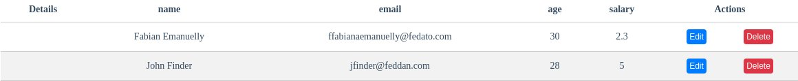
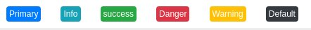

## Property actionsRow

The actionsRow property allows you to add action buttons to the records, clicking on the respective button will trigger an event returning the entire object of this line, we will see an example.

``` 
<template>
  <dm-datatable
   :actionsRow="[
        {
            title: "Edit",
            type: "primary",
            event: "handleEdit"
        },

        {
            title: "Delete",
            type: "danger",
            event: "handleDelete"
        }
    ]"
    @handleEdit="edit($event)"
    @handleDelete="delete($event)"
  />
</template>

<script lang="js">
  export default {

      methods: {
          edit (event) {},
          delete (event) {} 
      }
  }
</script>
```
<br />

### Rendering

<br /><br />

### Details props

* title: Button text.
* type: Button feedback color.
* event: Name of the event that will be triggered when you click the button.
<br /><br />

### Feedback options
* primary
* info
* success
* danger
* warning
* default

### Rendering Feedback options

