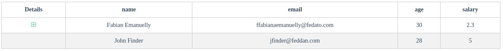
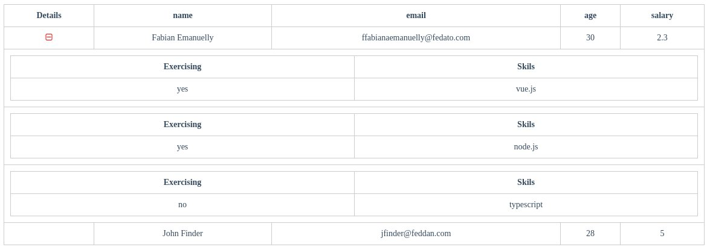

## Property modelChildrenRow

Property modelChildren follows the same rules as the rows property but with one exception. The key of each property of the modelChildren object must be equal to the value of the key "name" of the children object, which is a property of the rows object that we will see shortly, if the values ​​do not match, the value of the property of the children object will not will be rendered.

``` 
Ex:

[      
    { title: "Active", name: "active" },
    { title: "Skils", name: "skils" }
]
``` 

### Complete example of a rows object with child options

```
Ex:

{
    data: [
        {
            name: "Fabian Emanuelly",
            email: "ffabianaemanuelly@fedato.com",
            age: 30,
            salary: 2.300,
            children: [
                { 
                    active: "yes", 
                    skils: "vue.js" 
                },
                { 
                    active: "yes", 
                    skils: "node.js"
                },
                { 
                    active: "no", 
                    skils: "typescript"
                },
            ]
        },

        {
            name: "John Finder",
            email: "jfinder@feddan.com",
            age: 28,
            salary: 5.000,
            children: []
        }
    ]
}
```

### Rendering

<br /><br />

Note that when a row object has its children property filled in, an icon will appear in the details column indicating that that object has child objects to be shown.
<br />


In the image below we can see what the children look like when they click on the icon. The structure of the children's table will follow that of the main table, note that in this example the borders were inherited.

### Rendering

<br />


